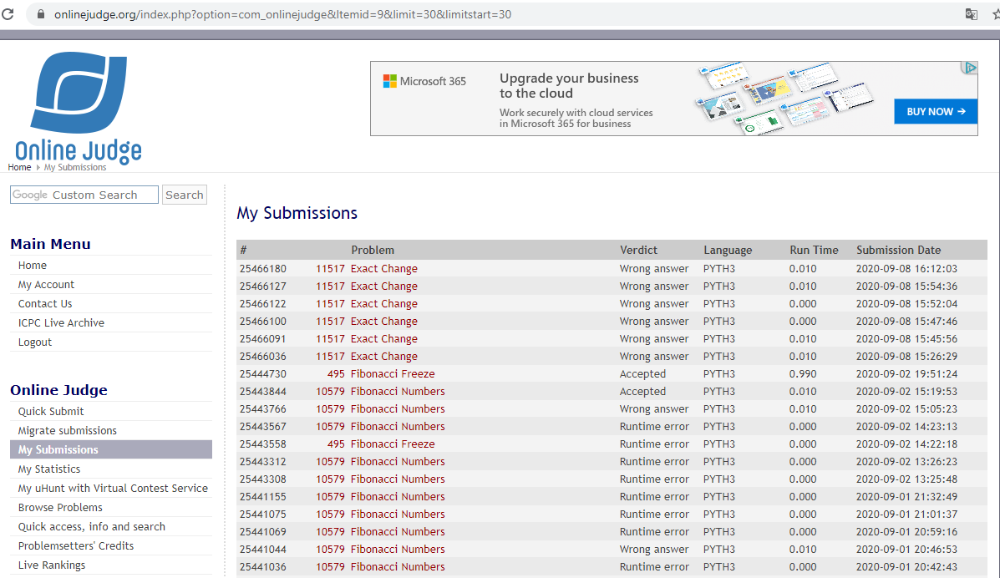

# Trabalho de Programação -- Programação Dinâmica -- Parte 1
**Autor:** Edimar Antonio da Cruz
**Data:** 08 de setembro de 2020
**Problema:** 00495 -- Fibonacci Freeze
## Sobre a Solução
Este diretório contém o código fonte gerado para solucionar o problema 00495
do *Online Judge*. O problema recebeu veredito \Accepted", como mostrado na
figura abaixo:

O programa foi desenvolvido em Python
